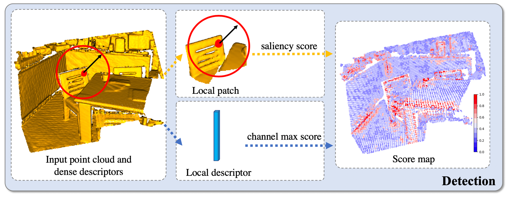

# D3Feat repository

TensorFlow implementation of D3Feat for CVPR'2020 paper ["D3Feat: Joint Learning of Dense Detection and Description of 3D Local Features"](https://arxiv.org/abs/2003.03164), by Xuyang Bai, Zixin Luo, Lei Zhou, Hongbo Fu, Long Quan and Chiew-Lan Tai.

This paper focus on dense feature detection and description for 3D point clouds in a joint manner. If you find this project useful, please cite:

```bash
@article{bai2020d3feat,
  title={D3Feat: Joint Learning of Dense Detection and Description of 3D Local Features},
  author={Xuyang Bai, Zixin Luo, Lei Zhou, Hongbo Fu, Long Quan and Chiew-Lan Tai},
  journal={arXiv:2003.03164 [cs.CV]},
  year={2020}
}

```

## Introduction

A successful point cloud registration often lies on robust establishment of sparse matches through discriminative 3D local features. Despite the fast evolution of learning-based 3D feature descriptors, little attention has been drawn to the learning of 3D feature detectors, even less for a joint learning of the two tasks. In this paper, we leverage a 3D fully convolutional network for 3D point clouds, and propose a novel and practical learning mechanism that densely predicts both a detection score and a description feature for each 3D point. In particular, we propose a keypoint selection strategy that overcomes the inherent density variations of 3D point clouds, and further propose a self-supervised detector loss guided by the on-the-fly feature matching results during training. Finally, our method achieves state-of-the-art results in both indoor and outdoor scenarios, evaluated on 3DMatch and KITTI datasets, and shows its strong generalization ability on the ETH dataset. Towards practical use, we show that by adopting a reliable feature detector, sampling a smaller number of features is sufficient to achieve accurate and fast point cloud alignment.




## Installation

* Create the environment and install the required libaries:

           conda env create -f environment.yml

* Compile the customized Tensorflow operators located in `tf_custom_ops`. Open a terminal in this folder, and run:

          sh compile_op.sh

* Compile the C++ extension module for python located in `cpp_wrappers`. Open a terminal in this folder, and run:

          sh compile_wrappers.sh
          
The code is heavily borrowed from [KPConv](https://github.com/HuguesTHOMAS/KPConv/). You can find the guidance for compiling the tensorflow operators and C++ wrappers in [INSTALL.md](https://github.com/HuguesTHOMAS/KPConv/blob/master/INSTALL.md).

      
## Dataset Download

**3DMatch**

The training set of [3DMatch[1]](#refs) can be downloaded from [here](https://drive.google.com/file/d/1Vo-D_NOs4HS9wwAE-55ggDpgaPfzdRRt/view?usp=sharing). It is generated by `datasets/cal_overlap.py` which select all the point cloud fragments pairs having more than 30% overlap.

The test set point clouds and the evaluation files(for registration recall) can be downloaded from [3DMatch Geometric Registration website.](http://3dmatch.cs.princeton.edu/#geometric-registration-benchmark)

Please put the training set under `data/3DMatch` folder and the test set under `data/3DMatch/fragments`. And I have already put the ground truth poses in the `geometric_registration/gt_result` folder.

**KITTI**

The training and test set can be download from [KITTI Odometry website.](http://www.cvlibs.net/datasets/kitti/eval_odometry.php) I follow the [FCGF[3]](#refs) for pre-processing.

**ETH**

The test set (we only use ETH dataset to evaluate the generalization ability of our method) can be downloaded from [here](https://share.phys.ethz.ch/~gsg/3DSmoothNet/data/ETH.rar). Detail instructions can be found in [PerfectMatch[2]](#refs).

## Instructions to training and testing

### 3DMatch

The training on 3DMatch dataset can be done by running
```bash
python training_3dmatch.py
```
This file contains a configuration subclass `ThreeDMatchConfig`, inherited from the general configuration class Config defined in `utils/config.py`. The value of every parameter can be modified in the subclass. The default path to 3DMatch training set is `data/3DMatch`, which can be changed in `dataset/ThreeDMatch.py`. 

The testing with the pretrained models on 3DMatch can by easily done by changing the path of log in `test_3dmatch.py` file

```python
chosen_log = 'path_to_pretrained_log'
```

and runing

```bash
python test_3dmatch.py
```

The descriptors and detection scores for each point will be generated and saved in `geometric_registration` folder. Then the `feature matching recall` and `inlier ratio` can be caluclated by running
```bash
cd geometric_registration/
python evaluate.py D3Feat [timestr of the model]
```
The `registration recall` can be calculated by running the `evaluate.m` in `geometric_registration/3dmatch` which are provided by [3DMatch.](https://github.com/andyzeng/3dmatch-toolbox/tree/master/evaluation/geometric-registration)


### KITTI
Similarly, the training and testing of KITTI data set can be done by running
```bash
python training_KITTI.py
```
And 
```bash
python test_KITTI.py
```

### Keypoint Repeatability

For keypoint repeatability, after generating the descriptors and detection scores, then run

```bash
python evaluate_3dmatch_our.py D3Feat [timestr of the model]
```

or

```bash
python evaluate_kitti_our.py D3Feat [timestr of the model]
```


## Pretrained Model

We provide the pre-trained model of 3DMatch in `results/` and KITTI in `results_kitti/`

## References
<a name="refs"></a>

[1] 3DMatch: Learning Local Geometric Descriptors from RGB-D Reconstructions, Andy Zeng, Shuran Song, Matthias Nießner, Matthew Fisher, Jianxiong Xiao, and Thomas Funkhouser, CVPR 2017.

[2] The Perfect Match: 3D Point Cloud Matching with Smoothed Densities, Zan Gojcic, Caifa Zhou, Jan D. Wegner, and Andreas Wieser, CVPR 2019.

[3] Fully Convolutional Geometric Features: Christopher Choy and Jaesik Park and Vladlen Koltun, ICCV 2019.

